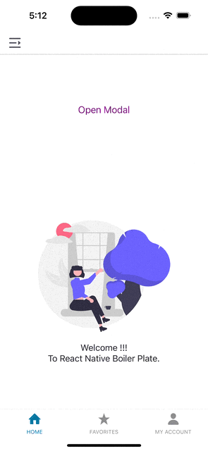

# rn-draggable-modal

    

**rn-draggable-modal** is a tiny Javascript library which provides an elegant UI for the end user to use customize modal. It also features a carefully crafted flow to handle edge cases for volatile user gestures. We provide default UI, but you can always customize the appearance as you like.

## Sample



## Installation

`npm install --save rn-draggable-modal`

or

`yarn add rn-draggable-modal`

## PeerDependencies

### NOTES:

This packgae will support react@^17.0.0, react@^18.0.0,react-native@^0.68.0,react-native@^0.69.0,react-native@^0.70.0, react-native@^0.71.0. Make sure you have install respective viersion.

`npm install --save react@18.2.0 react-native@0.72.3`

or

`yarn add react@17.0.0 react-native@0.72.3`

## Basic Usage

```
import DraggableModal from 'rn-draggable-modal';

...
const [isHalfModalVisible, setHalfModalVisible] = useState(false);
...
      <DraggableModal
        modalVisible={isHalfModalVisible}
        setModalVisible={setHalfModalVisible}
        dragIconName="dots"
        modalInitialHeight={200}
        dragIconColor="skyblue"
        children={
          <ScrollView
            contentContainerStyle={{
              flexGrow: 1,
              paddingHorizontal: 5,
            }}>
            <Text>Welcome to React Native....</Text>
          </ScrollView>
        }
      />
```

## More Advanced Usage

```
import DraggableModal from 'rn-draggable-modal';

...
const [isHalfModalVisible, setHalfModalVisible] = useState(false);
...
    <DraggableModal
        modalVisible={isHalfModalVisible}
        setModalVisible={setHalfModalVisible}
        dragIconName="dots"
        modalWidth="80%"
        modalInitialHeight={200}
        hasDraggable={false}
        dragIconColor="skyblue"
        numberOfDots={5}
        hasDraggableIcon={false}
         dragIconStyle={{    //dots style
           backgroundColor: 'green',
           width: 8,
           height: 8,
           borderRadius: 4,
           marginHorizontal: 3,
         }}
       children={
          <ScrollView
            contentContainerStyle={{
              flexGrow: 1,
              paddingHorizontal: 5,
            }}>
            <Text>Welcome to React Native....</Text>
          </ScrollView>
        }
      />
```

## Parameters

| Parameter          | Required | Type        | Default                                                                                          | Description                                                 |
| ------------------ | -------- | ----------- | ------------------------------------------------------------------------------------------------ | ----------------------------------------------------------- |
| modalVisible       | `Yes`    | `Boolean`   | `false`                                                                                          | The visible prop determines whether your modal is visible.. |
| setModalVisible    | `No`     | `Function`  | `()=>{}`                                                                                         | This callback is called when user taps outside of a Modal.  |
| dragIconName       | `No`     | `String`    | `bar`                                                                                            | `dragIconName` can be bar or dots.                          |
| modalWidth         | `No`     | `String`    | `100%`                                                                                           | Width of modal in percentage.                               |
| modalInitialHeight | `No`     | `String`    | `50% of screen`                                                                                  | Height of modal at inital render.                           |
| hasDraggable       | `No`     | `Boolean`   | `true`                                                                                           | Enable draggable feature for modal.                         |
| dragIconColor      | `No`     | `String`    | `#A3A3A3`                                                                                        | Change dragIcon Color of modal .                            |
| numberOfDots       | `No`     | `Number`    | `3`                                                                                              | Change number of dots in modal.                             |
| hasDraggableIcon   | `No`     | `String`    | `true`                                                                                           | Enable draggable feature for draggable Icon.                |
| dragIconStyle      | `No`     | `String`    | `{{width: 40,height: 6,borderRadius: 3,}}`                                                       | Change the style of the dragIcon.                           |
| children           | `yes`    | `Component` | `<ScrollView contentContainerStyle={{flexGrow: 1}}><Text>This is half modal</Text></ScrollView>` | To render child component within modal.                     |

## Contributing

Pull requests are always welcome! Feel free to open a new GitHub issue for any changes that can be made.

## Author


[Jayanta Garu](https://github.com/jayanta-hub)

## License

MIT
